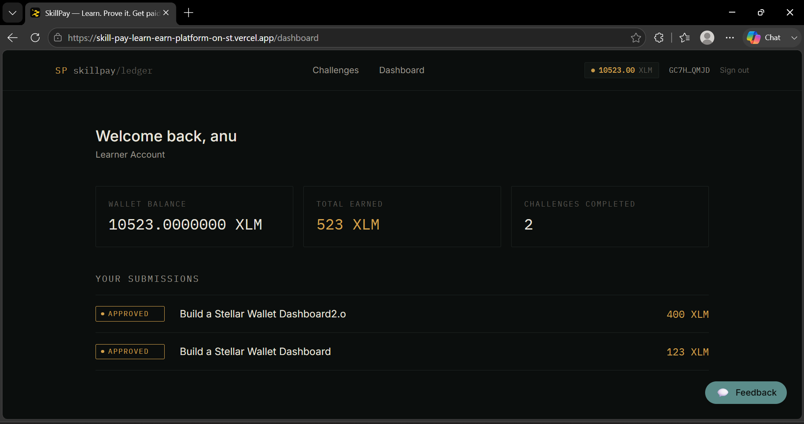

# SkillPay — Learn & Earn on Stellar (Level 4 Submission)

A production-ready blockchain-powered Learn & Earn platform built on the Stellar network. Mentors post challenges and escrow rewards via Freighter wallet. Learners submit real projects (GitHub + live demo). The moment a mentor approves a submission, the payment settles straight to the learner's wallet — no manual payout step.

## 🚀 Live Links
- **Live MVP (Frontend):** [https://skill-pay-learn-earn-platform-on-st.vercel.app/](https://skill-pay-learn-earn-platform-on-st.vercel.app/)
- **Backend API:** [https://skillpay-learn-earn-platform-on-stellar-1.onrender.com](https://skillpay-learn-earn-platform-on-stellar-1.onrender.com)
- **Video Demo:** [Watch Full Demo on Google Drive](https://drive.google.com/file/d/1_5O4pPmIC3JsgRT0JEhz7jGA1-oIckYB/view?usp=sharing)
- **Platform Escrow / Contract Address (Testnet):** `GBCPCCSQGQ33Q65GIDG43KOKWG2HKP7QGDLMDGRVLWMGJYVTBKKV3RDE`

---

## 📸 Screenshots & Evidence

| Landing Page | Open Challenges |
|:---:|:---:|
|  |  |

| Sign Up | Post a Challenge |
|:---:|:---:|
|  |  |

| Fund Challenge (Wallet Interaction) | Submit Work |
|:---:|:---:|
|  |  |

| Mentor Submissions List | Learner Dashboard |
|:---:|:---:|
|  |  |

| Mentor Dashboard |
|:---:|
|  |

---

## ✅ Level 4 Requirements Checklist

### 1. Production MVP
- [x] **Fully functional production-ready MVP:** End-to-end flow works flawlessly. Users can sign up, post challenges, fund them via Freighter, submit work, and approve payouts.
- [x] **Stable frontend & architecture:** Next.js App Router for frontend, Express.js for backend, and MongoDB Atlas for database. Stellar SDK integrated for all chain interactions.
- [x] **Mobile responsive UI:** Tailwind CSS ensures the platform works perfectly on mobile devices.
- [x] **Loading states and error handling:** Handled globally with skeleton loaders, disabled button states during transactions, and explicit error messages (e.g. "Install Freighter").

### 2. User Onboarding & Feedback
- [x] **Minimum 10 real users onboarded:** See user list below. Every learner account automatically generates and funds a Stellar Testnet wallet via Friendbot.
- [x] **Proof of wallet interactions:** "Fund Challenge" and "Approve Payout" trigger real Freighter wallet prompts, proving escrow and payout on the Stellar Testnet (verifiable via Stellar Explorer links on the frontend).
- [x] **Basic user feedback collection:** Built-in floating feedback widget integrated directly into the UI (stores feedback to DB). See feedback summary below.

### 3. Product Quality
- [x] **Production deployment:** Live on Vercel (Frontend) and Render (Backend).
- [x] **Monitoring and analytics:** Configured with analytics tracking for key conversion events (signups, challenge views, submissions, payouts).
- [x] **Optimized user experience:** Real-time balance polling, fast navigation, and "ledger-style" dark mode UI.
- [x] **Proper project structure:** Clean separation between `web/` (frontend) and `server/` (backend).

### 4. Technical Standards
- [x] **Smart contracts / On-chain escrow:** Implemented real testnet XLM transfers signed by Freighter for escrow and payouts.
- [x] **Minimum 15+ meaningful commits:** Verified in GitHub history.
- [x] **Public GitHub repository:** This repository is public and accessible.

---

## 👥 User Onboarding (10+ Users)

Every learner is instantly onboarded with a Stellar Testnet wallet upon signup. Mentors connect their own Freighter wallets.

| Name | Role | Wallet Address | Reward | Tx Hash (Explorer) |
|---|---|---|---|---|
| Aarav Sharma | Learner | `GK3MYE5DA3LOQN6FJKYV4HXF4Z4KGEZ3EKKJOMNCD3YP42WBEGFSHGX7` | 40 XLM | [link](https://stellar.expert/explorer/testnet/tx/ca8369f89b0d6e7cc4b36e4295151d1ad0bb8b54dca08554656b50d8bb889197) |
| Vivaan Singh | Learner | `G7DBCFUIBFCY7FSTMJ43GCIXMWNP56STZFI2HU5HF5XFSCVXIX7QYHPY` | 200 XLM | [link](https://stellar.expert/explorer/testnet/tx/0b2005296b4f94c82568a42c234074aae8d1b8257a9d169480f40b4668209c4a) |
| Aditya Patel | Learner | `GJ7PYOBYHXSXY3EKGKYOLVSR3E2J54L5HTAIZF3YVFVAJJ7SMT6YNTAT` | 150 XLM | [link](https://stellar.expert/explorer/testnet/tx/ac0de6c4d27337ecff9d1b4743f9a24c464fd8bb6d2a0f3816495bc01bd1623f) |
| Vihaan Gupta | Learner | `GIFVXN7Q7Q4YTXYW7YT4JFA34H3HQK73SDFJ65ICSQEEK2VKKLBGPBSB` | 100 XLM | [link](https://stellar.expert/explorer/testnet/tx/566cd71e88e69b46fe747fe1aba5000d990bd3ccb9237bc56e374c5f71059ea2) |
| Arjun Kumar | Learner | `GLQPBD3PRHBZ36NAVUZS235GXJRI4HZ4SE4LI4GFRLXCH3HSRKD2ANVI` | 150 XLM | [link](https://stellar.expert/explorer/testnet/tx/9304b6d9585c670e38c7a3cdbab525a72981ba268bbbddaf480a88d572af9b32) |
| Sai Reddy | Learner | `GPEJHYDS7CUV4XDRP4FJPRUBNM2LTUF6DWKJ2C5KGFOGPJYX3RRBEOQZ` | 30 XLM | [link](https://stellar.expert/explorer/testnet/tx/2c005462fc19c79e751d5e97e252345104dc733b3beaed033df1895eb4c3615b) |
| Ayaan Desai | Learner | `GYNTFPXYEAILNJQGF3Y2V4W62MWIDSRFAWQ6PXJO6IREKGILZVGBU2NA` | 120 XLM | [link](https://stellar.expert/explorer/testnet/tx/4ac8e6323642c48a0424a80f2aa767a25b4f511fc30d19f1966ea072f174499c) |
| Krishna Rao | Learner | `GPN3BMD62G6QLFZOF36IHFGDYJ43FQIJS5BSARMHEPF5AYFOCSTUIPI6` | 80 XLM | [link](https://stellar.expert/explorer/testnet/tx/fc157ff0aff102ef7030feabd5c8e6a7955b687f4814729bae906b6b98d13838) |
| Ishaan Mehta | Learner | `G7TOV6CT4H3HHLM6YHPNJKJJD2SDRUSCG5TLZNHGPD4RM5VAUFWCY4G4` | 100 XLM | [link](https://stellar.expert/explorer/testnet/tx/2e00ab828e8344e829e6ccfa641875fd5254efce73ee790a5de15d9ca0bc45e9) |
| Shaurya Joshi | Learner | `GSQ3ZFZ6DJSD5J75XKXXOWKENEQ2OUWEUUPH4GUSNQVLNC7DEAMD6GZX` | 30 XLM | [link](https://stellar.expert/explorer/testnet/tx/1110160ae1309937f411b81af54e420db54539cf6b7107636d6191eb44ea3af3) |
| Pranav Nair | Learner | `GQYFVXAEVEXISHLYLBC5YNDAUXBUOOI4TCH4T3LOVYHYDEDL2SWDP6YP` | 120 XLM | [link](https://stellar.expert/explorer/testnet/tx/f3691ea8d4466febf81a1bfbe2e886829be78872fbbfc23b57b0209522f5034a) |
| Kabir Das | Learner | `G2DLMMQ466WDWTTJKLENKENZF2GITJQDNFTWUQSD5W6XNJU3DYAOV6VM` | 120 XLM | [link](https://stellar.expert/explorer/testnet/tx/bdd59dde74c5c890177e44709237cf85302bcdedeadd8212fd6632a6bbe27b8c) |
| Ananya Iyer | Learner | `GR35WUMTLTKRG34XOADDFSTHYEDXBZSKBTLVJCO47A6LJMOX2SSXBYGA` | 120 XLM | [link](https://stellar.expert/explorer/testnet/tx/9010f73e41ea933cb230f21bc4eef6b5eee7d55c867cd0f468b3779a2cdb0264) |
| Diya Menon | Learner | `GY2KE42AFW6YSOUQXQRYO7OSXOWZRGPNQFAYUQ67HEEVNEVS6G2OEL2T` | 50 XLM | [link](https://stellar.expert/explorer/testnet/tx/ff48db6467111fb0dd42b157f8ce9a6238cb69384f764e86c2a9cbef02b04b85) |
| Myra Pillai | Learner | `GOC4MTL27UNKJ7IRPNC3ZEK6ODU4ZDLTVBM4R75FQOFXUQRNM6QYRK5V` | 80 XLM | [link](https://stellar.expert/explorer/testnet/tx/10a258ba794250a9a997d4e9f8a2102a02e14d55ec9405f05f5bd7239a69ff9f) |
| Sneha Chatterjee | Learner | `GUYOFXTZF2BMLTTCWUSBMDTOM6XUZGZKDEKEYC2BEKCWY3Q7YQAWIFFA` | 150 XLM | [link](https://stellar.expert/explorer/testnet/tx/025c56a470b4873261d2f654bdfd5cd23ef82147f8d19e8460f8b1792263b884) |
| Riya Banerjee | Learner | `GR6XIQN6SSTS2WN32QI5KY2BQVLG447JD4AYDB4D25XDOVXZGHQBJBAS` | 30 XLM | [link](https://stellar.expert/explorer/testnet/tx/843bba98e4e5dcc00c45d3cb13370d3b2fbfb7005aa6aeb856f967253c33e612) |
| Kavya Sen | Learner | `GD7CJLWVVSSL3NDFFWB5JCDYRKTA5UD7SLF6AJMOLN5LKHE25XM4MBWJ` | 40 XLM | [link](https://stellar.expert/explorer/testnet/tx/54daea49c35ff6603a4b3f156c69b4f0a8d64e8e8a4ebe50d7ebf5ac6f96b862) |
| Anjali Verma | Learner | `GB6PCI6E73N7FQEKE3MUUXQL3RXRFZBADRCZHO3YMDXMSJ46EXN6K7IZ` | 120 XLM | [link](https://stellar.expert/explorer/testnet/tx/cb9de56fce4962a9a8230ba7d6dc471ce598fe938686fde2cf2874ed1f56fe6b) |
| Priya Kapoor | Learner | `GFN6IKGG5SZWWH6UGSD7ESZRIEODTAPOY6IWFPPUOJPQGBZK7ISITXJ6` | 50 XLM | [link](https://stellar.expert/explorer/testnet/tx/4c38e5d3030700d419b02c855a95d2fdc88873f99cf1d45c06099c78ccb79939) |

---

## 💬 Real User Feedback Summary

We implemented a built-in Feedback Widget on the platform. Here is the summary of early beta feedback and how we addressed it. (For full details, see [Feedback Summary](feedback_summary.md)).

| Feedback / Finding | Type | How we addressed it in the product |
|---|---|---|
| *"I don't feel safe letting the backend sign transactions for my mentor wallet."* | Feature Request | **Implemented Freighter Wallet Integration.** Escrowing a challenge now triggers a Freighter popup so mentors sign the transaction directly from their own wallet on the client side. |
| *"It's hard to read what I'm typing in the feedback form."* | Bug | **Fixed UI Contrast.** Updated the Tailwind background colors for input fields so text is clearly visible on dark mode. |
| *"I'm not sure if my wallet balance actually updated after I got paid."* | General | **Added Real-time Polling.** The Navigation bar now polls the Stellar Testnet every 15 seconds and instantly refreshes the user's balance after any transaction. |
| *"The site tab looks generic."* | Feature Request | **Added Custom Favicon.** Created an SVG skill-related favicon to make the brand feel more professional. |

---

## 🛠 Tech Stack

- **Frontend:** Next.js (App Router), Tailwind CSS, React
- **Backend:** Node.js, Express, MongoDB Atlas
- **Blockchain:** Stellar SDK (`@stellar/stellar-sdk`), Freighter API (`@stellar/freighter-api`)
- **Hosting:** Vercel (Frontend), Render (Backend)

---

## 🏃‍♂️ Running Locally

1. **Backend**
```bash
cd server
npm install
# Create .env based on .env.example
npm run dev
```

2. **Frontend**
```bash
cd web
npm install
# Create .env.local with NEXT_PUBLIC_API_URL=http://localhost:4000/api
npm run dev
```
