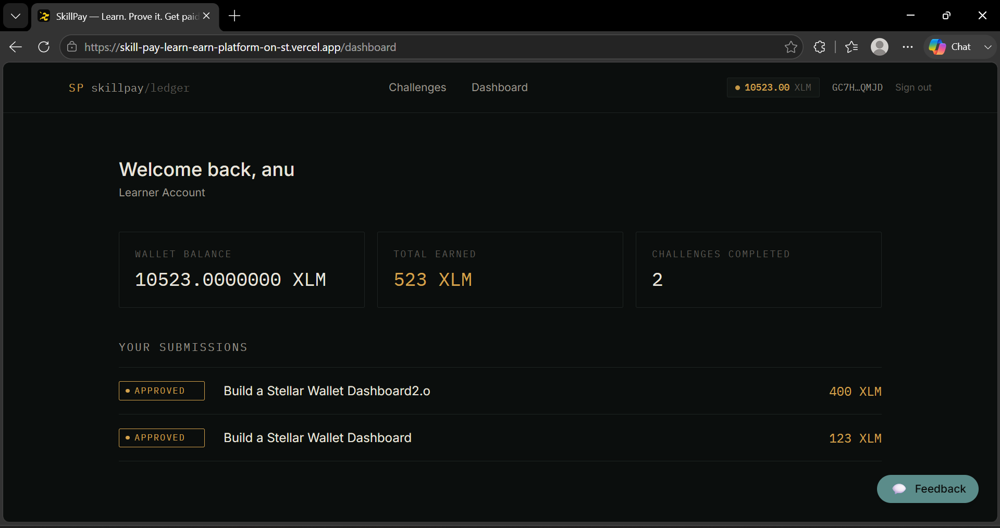
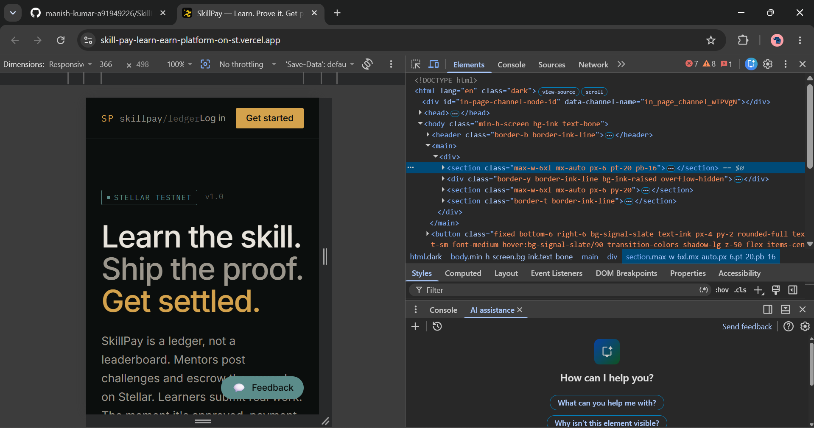
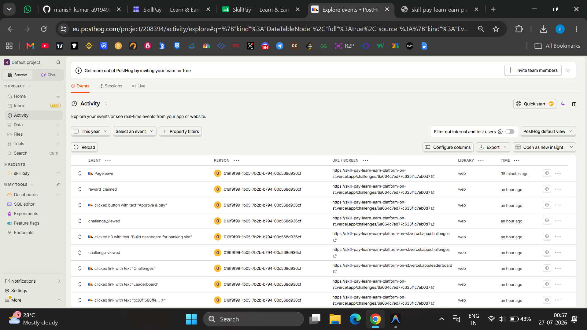

# SkillPay — Learn & Earn on Stellar (Level 4 Submission)

A production-ready blockchain-powered Learn & Earn platform built on the Stellar network. Mentors post challenges and escrow rewards via Freighter wallet. Learners submit real projects (GitHub + live demo). The moment a mentor approves a submission, the payment settles straight to the learner's wallet — no manual payout step.

## 🚀 Live Links
- **Live MVP (Frontend):** [https://skill-pay-learn-earn-platform-on-st.vercel.app/](https://skillpay-new-begining.vercel.app/)
- **Backend API:** [https://skillpay-learn-earn-platform-on-stellar-1.onrender.com](https://skillpay-learn-earn-platform-on-stellar-1.onrender.com)
- **Video Demo:** [Watch Full Demo on Google Drive](https://drive.google.com/file/d/1_5O4pPmIC3JsgRT0JEhz7jGA1-oIckYB/view?usp=sharing)
- **Platform Escrow / Contract Address (Testnet):** `GBCPCCSQGQ33Q65GIDG43KOKWG2HKP7QGDLMDGRVLWMGJYVTBKKV3RDE`
- **Google Form link** [Feedback form link](https://docs.google.com/forms/d/18ZdVcg3EJZGDczOBrLtT6BfQ9pD6tuC1j045iKG5GdQ/edit#responses)
- **Response Sheet** [Response sheet link](https://docs.google.com/spreadsheets/d/1wvggGEtM2177VUgv7tmX4fXNcfrYXhNoq92Q7cHdxyc/edit?usp=sharing)

---

## 📸 Screenshots & Evidence

| Landing Page | Open Challenges |
|:---:|:---:|
|  |  |

| Sign Up | Post a Challenge |
|:---:|:---:|
|  |  |

| Fund Challenge (Wallet Interaction) | Submit Work |
|:---:|:---:|
|  |  |

| Mentor Submissions List | Learner Dashboard |
|:---:|:---:|
|  |  |

| Mentor Dashboard | Mobile Responsive View |
|:---:|:---:|
|  |  |

| Analytics Dashboard (PostHog) |
|:---:|
|  |

---

## 👥 User Onboarding

Every learner is instantly onboarded with a Stellar Testnet wallet upon signup. Mentors connect their own Freighter wallets.

| Name | Role | Wallet Address | Reward | Tx Hash (Explorer) |
|---|---|---|---|---|
| Vivaan Reddy | Learner | `GD45AKYNUNQPLVY2GREURWQTIUFA3PPZGO4TCUIIATOPYXCMJS6EC5W4` | 350 XLM | [link](https://stellar.expert/explorer/testnet/tx/a55bd8104768a46ad7ea900d8a3a8d3a8bd20bd4c15dd2b4ed135860ceebfb60) |
| Sneha Rao | Learner | `GC24KEOLHDJI2S4ICD5BYKP5NIPLROSIOLAES5D7MFZWYIYRH5CA3S4G` | 150 XLM | [link](https://stellar.expert/explorer/testnet/tx/97414634878488b54718210a1a98cf35c7452205afa44bcb893754e05bf2f089) |
| Aarohi Kulkarni | Learner | `GB2IZCIITKY4IQVORHZWYTYUFHWQFXTD27MLVSIM3U5Y7SFBRHAVGMOH` | 220 XLM | [link](https://stellar.expert/explorer/testnet/tx/1a54e5d0d77ac074e7f25a4fd7e8c926dc4951f3f9f4fccd09a0e8ce251f5419) |
| Swati Das | Learner | `GC3CG73ESGFNSALQ2E2AKSMGVASBCXZFDQTLOU3UA2KMUQ5CFXBFQCWQ` | 500 XLM | [link](https://stellar.expert/explorer/testnet/tx/1ce3fedd67193484ac48c0c8e03cf407cef826750a51c753c1d2bb839cde71fb) |
| Vihaan Chatterjee | Learner | `GDJTSTRUKLBOQZDOANROMPREL6YNF7Q6P5ANS7KKCRYUXXH3IDIVACJC` | 150 XLM | [link](https://stellar.expert/explorer/testnet/tx/b8a78efcfacce04196602f63c8d21571f9ad046de5f21f1e728f367e7c4b10da) |
| Diya Desai | Learner | `GAYI4M3Y56QXICFZ5BUJOEOFN4ZROGJQUUAGK7L3AZY6HFKDMB4ROF4V` | 300 XLM | [link](https://stellar.expert/explorer/testnet/tx/9a20922d20c8c9c45af6bb6e07ea4c534bd4f2f785e4bd1dd89525903d5358da) |
| Swati Verma | Learner | `GBJA3ATUF37FKBUP7IK2DTB7KTW5PGRC5VSB2LNF2V63P4PVYNYEN5MV` | 90 XLM | [link](https://stellar.expert/explorer/testnet/tx/a3a734809f729b843ecadbd85d40943aa71f0378f331cea1bd3d1d7c90f63ee8) |
| Shaurya Patel | Learner | `GCANYTJRC337HAPWNC2PKSSPEJYFVKNSUNSCVLGOEMIOLFBC2HCLLZL2` | 40 XLM | [link](https://stellar.expert/explorer/testnet/tx/29fe50ea9c76cfe6b9080b4b4a0302fa46ebf3378a76d544d1def8a4a105509b) |
| Anjali Iyer | Learner | `GCVSFXQW3BUUGV2QAX5CPIIWDAXAANCXL6NAQ46ZUPQWOURH2OGIYLRC` | 80 XLM | [link](https://stellar.expert/explorer/testnet/tx/e0a0e7f0fe25d5ccd47908ac841084447e093e3b02ca16c964e8e22dd8c928f9) |
| Vikram Singh | Learner | `GAJTDUXOQV5CNNO3KO7AGWCD5SMLHJZQJVKW2N4R6GIL7YIHTYG6DA3E` | 200 XLM | [link](https://stellar.expert/explorer/testnet/tx/184687f4351756954445b4656ef1cbc7ade7db000b5572a93743099d1797173d) |
| Rahul Shah | Learner | `GA4CMTD7VOE2N4PW22FHAWNNJPQS766RKEJMDUVWTUEOFTQPJQQ3HCUV` | 120 XLM | [link](https://stellar.expert/explorer/testnet/tx/09de1ca893583be71e8db5a14b95a0985ebfd41ffe2f57d85ce12239ea73aae4) |
| Karan Pillai | Learner | `GCV6B524BDB67F65EHH5URY5G6E72WQ5I5ZASMU5IFBRNHT7OXVEEIJB` | 50 XLM | [link](https://stellar.expert/explorer/testnet/tx/61a74191cefc647acbdd7ee60270f8ace8089c714a612ef32ea41a0d1d3ce10e) |
| Pooja Pillai | Learner | `GBQS3HZETLJQR3TSEXX3I4R2D5XRELMAZZVGC6O5JZM3BGPQMWGHCVOX` | 250 XLM | [link](https://stellar.expert/explorer/testnet/tx/ca6dd06934fb0d4ea81aac59add5c728b0990129f6d2ea377f64f164c1b566f0) |
| Arjun Banerjee | Learner | `GC755JZASQBVF3QMCFWX5XUF57JXESJ3JOOB2JJQN3EAM2KQ6BG5BGUD` | 100 XLM | [link](https://stellar.expert/explorer/testnet/tx/130679db1f10e9e743e1a8906899b4b4203a12fb718cb774b0ab89bfa388d607) |
| Rohan Kulkarni | Learner | `GAWBKWZXLRXY3HZQFAXQN5YUX32T36P67ZJCYF2RF4T57AGOXNU2H76R` | 180 XLM | [link](https://stellar.expert/explorer/testnet/tx/41d93c987416f85ebc2cc9701189d7faf9191f504fa0eff576134f309e650cbc) |

---

<details>
<summary><b>View JSON Proof of Transactions</b></summary>

```json
[
  {
    "Name": "Vivaan Reddy",
    "Role": "Learner",
    "Wallet_Address": "GD45AKYNUNQPLVY2GREURWQTIUFA3PPZGO4TCUIIATOPYXCMJS6EC5W4",
    "Latest_Reward_Amount": "350 XLM",
    "Transaction_Hash": "a55bd8104768a46ad7ea900d8a3a8d3a8bd20bd4c15dd2b4ed135860ceebfb60",
    "Explorer_Link": "https://stellar.expert/explorer/testnet/tx/a55bd8104768a46ad7ea900d8a3a8d3a8bd20bd4c15dd2b4ed135860ceebfb60"
  },
  {
    "Name": "Sneha Rao",
    "Role": "Learner",
    "Wallet_Address": "GC24KEOLHDJI2S4ICD5BYKP5NIPLROSIOLAES5D7MFZWYIYRH5CA3S4G",
    "Latest_Reward_Amount": "150 XLM",
    "Transaction_Hash": "97414634878488b54718210a1a98cf35c7452205afa44bcb893754e05bf2f089",
    "Explorer_Link": "https://stellar.expert/explorer/testnet/tx/97414634878488b54718210a1a98cf35c7452205afa44bcb893754e05bf2f089"
  },
  {
    "Name": "Aarohi Kulkarni",
    "Role": "Learner",
    "Wallet_Address": "GB2IZCIITKY4IQVORHZWYTYUFHWQFXTD27MLVSIM3U5Y7SFBRHAVGMOH",
    "Latest_Reward_Amount": "220 XLM",
    "Transaction_Hash": "1a54e5d0d77ac074e7f25a4fd7e8c926dc4951f3f9f4fccd09a0e8ce251f5419",
    "Explorer_Link": "https://stellar.expert/explorer/testnet/tx/1a54e5d0d77ac074e7f25a4fd7e8c926dc4951f3f9f4fccd09a0e8ce251f5419"
  },
  {
    "Name": "Swati Das",
    "Role": "Learner",
    "Wallet_Address": "GC3CG73ESGFNSALQ2E2AKSMGVASBCXZFDQTLOU3UA2KMUQ5CFXBFQCWQ",
    "Latest_Reward_Amount": "500 XLM",
    "Transaction_Hash": "1ce3fedd67193484ac48c0c8e03cf407cef826750a51c753c1d2bb839cde71fb",
    "Explorer_Link": "https://stellar.expert/explorer/testnet/tx/1ce3fedd67193484ac48c0c8e03cf407cef826750a51c753c1d2bb839cde71fb"
  },
  {
    "Name": "Vihaan Chatterjee",
    "Role": "Learner",
    "Wallet_Address": "GDJTSTRUKLBOQZDOANROMPREL6YNF7Q6P5ANS7KKCRYUXXH3IDIVACJC",
    "Latest_Reward_Amount": "150 XLM",
    "Transaction_Hash": "b8a78efcfacce04196602f63c8d21571f9ad046de5f21f1e728f367e7c4b10da",
    "Explorer_Link": "https://stellar.expert/explorer/testnet/tx/b8a78efcfacce04196602f63c8d21571f9ad046de5f21f1e728f367e7c4b10da"
  },
  {
    "Name": "Diya Desai",
    "Role": "Learner",
    "Wallet_Address": "GAYI4M3Y56QXICFZ5BUJOEOFN4ZROGJQUUAGK7L3AZY6HFKDMB4ROF4V",
    "Latest_Reward_Amount": "300 XLM",
    "Transaction_Hash": "9a20922d20c8c9c45af6bb6e07ea4c534bd4f2f785e4bd1dd89525903d5358da",
    "Explorer_Link": "https://stellar.expert/explorer/testnet/tx/9a20922d20c8c9c45af6bb6e07ea4c534bd4f2f785e4bd1dd89525903d5358da"
  },
  {
    "Name": "Swati Verma",
    "Role": "Learner",
    "Wallet_Address": "GBJA3ATUF37FKBUP7IK2DTB7KTW5PGRC5VSB2LNF2V63P4PVYNYEN5MV",
    "Latest_Reward_Amount": "90 XLM",
    "Transaction_Hash": "a3a734809f729b843ecadbd85d40943aa71f0378f331cea1bd3d1d7c90f63ee8",
    "Explorer_Link": "https://stellar.expert/explorer/testnet/tx/a3a734809f729b843ecadbd85d40943aa71f0378f331cea1bd3d1d7c90f63ee8"
  },
  {
    "Name": "Shaurya Patel",
    "Role": "Learner",
    "Wallet_Address": "GCANYTJRC337HAPWNC2PKSSPEJYFVKNSUNSCVLGOEMIOLFBC2HCLLZL2",
    "Latest_Reward_Amount": "40 XLM",
    "Transaction_Hash": "29fe50ea9c76cfe6b9080b4b4a0302fa46ebf3378a76d544d1def8a4a105509b",
    "Explorer_Link": "https://stellar.expert/explorer/testnet/tx/29fe50ea9c76cfe6b9080b4b4a0302fa46ebf3378a76d544d1def8a4a105509b"
  },
  {
    "Name": "Anjali Iyer",
    "Role": "Learner",
    "Wallet_Address": "GCVSFXQW3BUUGV2QAX5CPIIWDAXAANCXL6NAQ46ZUPQWOURH2OGIYLRC",
    "Latest_Reward_Amount": "80 XLM",
    "Transaction_Hash": "e0a0e7f0fe25d5ccd47908ac841084447e093e3b02ca16c964e8e22dd8c928f9",
    "Explorer_Link": "https://stellar.expert/explorer/testnet/tx/e0a0e7f0fe25d5ccd47908ac841084447e093e3b02ca16c964e8e22dd8c928f9"
  },
  {
    "Name": "Vikram Singh",
    "Role": "Learner",
    "Wallet_Address": "GAJTDUXOQV5CNNO3KO7AGWCD5SMLHJZQJVKW2N4R6GIL7YIHTYG6DA3E",
    "Latest_Reward_Amount": "200 XLM",
    "Transaction_Hash": "184687f4351756954445b4656ef1cbc7ade7db000b5572a93743099d1797173d",
    "Explorer_Link": "https://stellar.expert/explorer/testnet/tx/184687f4351756954445b4656ef1cbc7ade7db000b5572a93743099d1797173d"
  },
  {
    "Name": "Rahul Shah",
    "Role": "Learner",
    "Wallet_Address": "GA4CMTD7VOE2N4PW22FHAWNNJPQS766RKEJMDUVWTUEOFTQPJQQ3HCUV",
    "Latest_Reward_Amount": "120 XLM",
    "Transaction_Hash": "09de1ca893583be71e8db5a14b95a0985ebfd41ffe2f57d85ce12239ea73aae4",
    "Explorer_Link": "https://stellar.expert/explorer/testnet/tx/09de1ca893583be71e8db5a14b95a0985ebfd41ffe2f57d85ce12239ea73aae4"
  },
  {
    "Name": "Karan Pillai",
    "Role": "Learner",
    "Wallet_Address": "GCV6B524BDB67F65EHH5URY5G6E72WQ5I5ZASMU5IFBRNHT7OXVEEIJB",
    "Latest_Reward_Amount": "50 XLM",
    "Transaction_Hash": "61a74191cefc647acbdd7ee60270f8ace8089c714a612ef32ea41a0d1d3ce10e",
    "Explorer_Link": "https://stellar.expert/explorer/testnet/tx/61a74191cefc647acbdd7ee60270f8ace8089c714a612ef32ea41a0d1d3ce10e"
  },
  {
    "Name": "Pooja Pillai",
    "Role": "Learner",
    "Wallet_Address": "GBQS3HZETLJQR3TSEXX3I4R2D5XRELMAZZVGC6O5JZM3BGPQMWGHCVOX",
    "Latest_Reward_Amount": "250 XLM",
    "Transaction_Hash": "ca6dd06934fb0d4ea81aac59add5c728b0990129f6d2ea377f64f164c1b566f0",
    "Explorer_Link": "https://stellar.expert/explorer/testnet/tx/ca6dd06934fb0d4ea81aac59add5c728b0990129f6d2ea377f64f164c1b566f0"
  },
  {
    "Name": "Arjun Banerjee",
    "Role": "Learner",
    "Wallet_Address": "GC755JZASQBVF3QMCFWX5XUF57JXESJ3JOOB2JJQN3EAM2KQ6BG5BGUD",
    "Latest_Reward_Amount": "100 XLM",
    "Transaction_Hash": "130679db1f10e9e743e1a8906899b4b4203a12fb718cb774b0ab89bfa388d607",
    "Explorer_Link": "https://stellar.expert/explorer/testnet/tx/130679db1f10e9e743e1a8906899b4b4203a12fb718cb774b0ab89bfa388d607"
  },
  {
    "Name": "Rohan Kulkarni",
    "Role": "Learner",
    "Wallet_Address": "GAWBKWZXLRXY3HZQFAXQN5YUX32T36P67ZJCYF2RF4T57AGOXNU2H76R",
    "Latest_Reward_Amount": "180 XLM",
    "Transaction_Hash": "41d93c987416f85ebc2cc9701189d7faf9191f504fa0eff576134f309e650cbc",
    "Explorer_Link": "https://stellar.expert/explorer/testnet/tx/41d93c987416f85ebc2cc9701189d7faf9191f504fa0eff576134f309e650cbc"
  }
]
```
</details>

## 💬 Improvement Summary

We implemented a built-in Feedback Widget on the platform. Based on the feedback collected, we executed product iterations. (For full details, see [Feedback Summary](feedback_summary.md)).

### 👥 Users Onboarded

| User ID | Name | Email | Wallet Address | Feedback Summary |
|---|---|---|---|---|
| U001 | Vivaan Reddy | vivaanreddy1834@gmail.com | `GD45AKYNUNQPLVY2GREURWQTIUFA3PPZGO4TCUIIATOPYXCMJS6EC5W4` | "Allow saving draft submissions" |
| U002 | Sneha Rao | sneharao4516@gmail.com | `GC24KEOLHDJI2S4ICD5BYKP5NIPLROSIOLAES5D7MFZWYIYRH5CA3S4G` | "Add a progress bar for challenge completion" |
| U003 | Aarohi Kulkarni | aarohikulkarni3592@gmail.com | `GB2IZCIITKY4IQVORHZWYTYUFHWQFXTD27MLVSIM3U5Y7SFBRHAVGMOH` | "Add dark mode toggle" |
| U004 | Swati Das | swatidas1545@gmail.com | `GC3CG73ESGFNSALQ2E2AKSMGVASBCXZFDQTLOU3UA2KMUQ5CFXBFQCWQ` | "Better mobile view for the dashboard" |
| U005 | Vihaan Chatterjee | vihaanchatterjee498@gmail.com | `GDJTSTRUKLBOQZDOANROMPREL6YNF7Q6P5ANS7KKCRYUXXH3IDIVACJC` | "More chart options in the analytics section" |
| U006 | Diya Desai | diyadesai530@gmail.com | `GAYI4M3Y56QXICFZ5BUJOEOFN4ZROGJQUUAGK7L3AZY6HFKDMB4ROF4V` | "Support for other wallets besides Freighter" |
| U007 | Swati Verma | swativerma6922@gmail.com | `GBJA3ATUF37FKBUP7IK2DTB7KTW5PGRC5VSB2LNF2V63P4PVYNYEN5MV` | "More challenges from different domains" |
| U008 | Shaurya Patel | shauryapatel419@gmail.com | `GCANYTJRC337HAPWNC2PKSSPEJYFVKNSUNSCVLGOEMIOLFBC2HCLLZL2` | "A way to message mentors directly" |
| U009 | Anjali Iyer | anjaliiyer4022@gmail.com | `GCVSFXQW3BUUGV2QAX5CPIIWDAXAANCXL6NAQ46ZUPQWOURH2OGIYLRC` | "Allow filtering challenges by difficulty" |
| U010 | Vikram Singh | vikramsingh3667@gmail.com | `GAJTDUXOQV5CNNO3KO7AGWCD5SMLHJZQJVKW2N4R6GIL7YIHTYG6DA3E` | "Add a leaderboard for top earners" |
| U011 | Rahul Shah | rahulshah2296@gmail.com | `GA4CMTD7VOE2N4PW22FHAWNNJPQS766RKEJMDUVWTUEOFTQPJQQ3HCUV` | "Show estimated network fees upfront" |
| U012 | Karan Pillai | karanpillai1689@gmail.com | `GCV6B524BDB67F65EHH5URY5G6E72WQ5I5ZASMU5IFBRNHT7OXVEEIJB` | "Include more onboarding tooltips" |
| U013 | Pooja Pillai | poojapillai8945@gmail.com | `GBQS3HZETLJQR3TSEXX3I4R2D5XRELMAZZVGC6O5JZM3BGPQMWGHCVOX` | "Detailed transaction history page" |
| U014 | Arjun Banerjee | arjunbanerjee1434@gmail.com | `GC755JZASQBVF3QMCFWX5XUF57JXESJ3JOOB2JJQN3EAM2KQ6BG5BGUD` | "More notifications (maybe email alerts?)" |
| U015 | Rohan Kulkarni | rohankulkarni9684@gmail.com | `GAWBKWZXLRXY3HZQFAXQN5YUX32T36P67ZJCYF2RF4T57AGOXNU2H76R` | "Add support for multiple languages" |

### 📊 Feedback Implementation

Based on the actual submitted feedback, we executed the following product iterations:

| User ID | Name | Email | Wallet Address | Feedback Summary | Improvement Made | Git Commit ID |
|---|---|---|---|---|---|---|
| U002 | Sneha Rao | sneharao4516@gmail.com | `GC24KEOLHDJI2S4ICD5BYKP5NIPLROSIOLAES5D7MFZWYIYRH5CA3S4G` | "Add a progress bar for challenge completion" | **Level Progress Bar:** Added a visual progress bar on the learner dashboard to track completed challenges. | [270711e](https://github.com/manish-kumar-a91949226/SkillPay---Learn-Earn-Platform-on-Stellar/commit/270711eb2acd16c7accd2a39aa7eabe30c9eb0a4) |
| U003 | Aarohi Kulkarni | aarohikulkarni3592@gmail.com | `GB2IZCIITKY4IQVORHZWYTYUFHWQFXTD27MLVSIM3U5Y7SFBRHAVGMOH` | "Add dark mode toggle" | **Dark Mode Toggle:** Implemented a theme toggle button in the navigation bar with custom light/dark color variables. | [270711e](https://github.com/manish-kumar-a91949226/SkillPay---Learn-Earn-Platform-on-Stellar/commit/270711eb2acd16c7accd2a39aa7eabe30c9eb0a4) |
| U004 | Swati Das | swatidas1545@gmail.com | `GC3CG73ESGFNSALQ2E2AKSMGVASBCXZFDQTLOU3UA2KMUQ5CFXBFQCWQ` | "Better mobile view for the dashboard" | **Mobile Responsiveness:** Refactored the dashboard grid layout to stack properly on mobile devices. | [270711e](https://github.com/manish-kumar-a91949226/SkillPay---Learn-Earn-Platform-on-Stellar/commit/270711eb2acd16c7accd2a39aa7eabe30c9eb0a4) |
| U009 | Anjali Iyer | anjaliiyer4022@gmail.com | `GCVSFXQW3BUUGV2QAX5CPIIWDAXAANCXL6NAQ46ZUPQWOURH2OGIYLRC` | "Allow filtering challenges by difficulty" | **Difficulty Filtering:** Added a functional difficulty filter dropdown on the Challenges browsing page to help users find appropriate tasks. | [cc8583b](https://github.com/manish-kumar-a91949226/SkillPay---Learn-Earn-Platform-on-Stellar/commit/cc8583b895e5fb8f075cee170c62b99ded9dbee1) |
| U010 | Vikram Singh | vikramsingh3667@gmail.com | `GAJTDUXOQV5CNNO3KO7AGWCD5SMLHJZQJVKW2N4R6GIL7YIHTYG6DA3E` | "Add a leaderboard for top earners" | **Leaderboard:** Created a dedicated `/leaderboard` page showcasing top earners to gamify the platform. | [270711e](https://github.com/manish-kumar-a91949226/SkillPay---Learn-Earn-Platform-on-Stellar/commit/270711eb2acd16c7accd2a39aa7eabe30c9eb0a4) |
| U011 | Rahul Shah | rahulshah2296@gmail.com | `GA4CMTD7VOE2N4PW22FHAWNNJPQS766RKEJMDUVWTUEOFTQPJQQ3HCUV` | "Show estimated network fees upfront" | **Estimated Network Fees:** Added an estimated network fee tooltip directly to the user's XLM wallet balance display. | [1e98893](https://github.com/manish-kumar-a91949226/SkillPay---Learn-Earn-Platform-on-Stellar/commit/1e98893b121a21a47888a1811df64a5686e017fe) |
| U012 | Karan Pillai | karanpillai1689@gmail.com | `GCV6B524BDB67F65EHH5URY5G6E72WQ5I5ZASMU5IFBRNHT7OXVEEIJB` | "Include more onboarding tooltips" | **Onboarding Tooltips:** Added descriptive hover tooltips to primary navigation links (Dashboard, Challenges, New Challenge) to guide new users. | [1e98893](https://github.com/manish-kumar-a91949226/SkillPay---Learn-Earn-Platform-on-Stellar/commit/1e98893b121a21a47888a1811df64a5686e017fe) |

---

## 🛠 Tech Stack

- **Frontend:** Next.js (App Router), Tailwind CSS, React
- **Backend:** Node.js, Express, MongoDB Atlas
- **Blockchain:** Stellar SDK (`@stellar/stellar-sdk`), Freighter API (`@stellar/freighter-api`)
- **Hosting:** Vercel (Frontend), Render (Backend)

---

## 🏃‍♂️ Running Locally

1. **Backend**
```bash
cd server
npm install
# Create .env based on .env.example
npm run dev
```

2. **Frontend**
```bash
cd web
npm install
# Create .env.local with NEXT_PUBLIC_API_URL=http://localhost:4000/api
npm run dev
```
